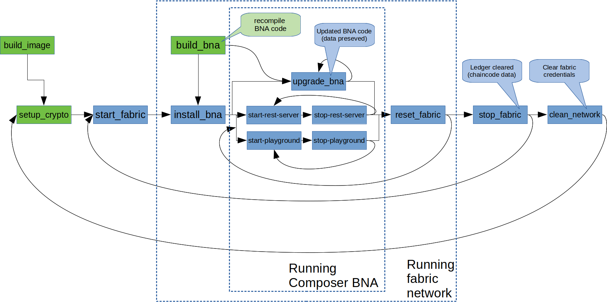

# Introduction
This is a docker-based devops setup for very easy deployment of hyperledger fabric and hyperledger composer. Its created for students for the [IS4302](https://ivle.nus.edu.sg/V1/lms/public/view_moduleoutline.aspx?CourseID=D09469F7-BC89-4BBC-84D9-C4CFDECCD288&ClickFrom=StuViewBtn) course, but everyone is welcomed to use and contribute.

Rather than a secure system, this meant for quick and robust deployment for educational and development purpose.
*Note:* Do not use for production

## Pre-requisites
This setup requires [docker](https://docs.docker.com/install/linux/docker-ce/ubuntu/#install-using-the-repository), docker-compose and [npm](https://www.npmjs.com/get-npm) as main dependancies, and generally \*nix type systems for commandline and bash commands.

## Limitations
Currently, this setup has a fixed 4-peer and 1-solo orderer configuration with fixed [configtx](deploy/configtx.yaml) and [crypto-config](deploy/crypto-config.yaml).

## Quick start
A sample test flow script is located in `scripts/testing/test_flow.sh`, which performs the following steps to start the system:
```
npm run build_image            #build images (only needs to be run once ever)
npm run test_bna               #run embedded unittests on BNA (all test_*.js files inside 'test' folder)
npm run setup_crypto           #setup crypto and config materials for fabric (based on 'deploy/configtx.yaml' and 'deploy/crypto-config.yaml')
npm run start_fabric           #setup all fabric docker containers
npm run build_bna marbles.bna  #compile BNA file, and write to file(argument 1)
npm run install_bna marbles-network marbles.bna  #deploy BNA file(arg 2) to network using name(arg 1)
npm run start_playground       #(optional) start hyperledger composer
```
At this point, hyperledger fabric and BNA of hyperledger composer is fully deploy and usable.
To add new identities manually, use:
```
npm run add_participant maeid1 mae@biznet.org marbles-network
```
to add a new participant for the `marble-network` BNA, with card `maeid1` and participant id `mae@biznet.org`.
*Note:* for anything other than `marble-network`, the `participant` entity should first be created using its associated custom arguments.

To access the composer functions using a REST server:
```
# Start Rest Server with maeid1 Card on port 3001
# SYNTAX: Card Name is <UNIQUE_IDENTIFIER>@<Business Network Name>
npm run start_rest-server maeid1@marbles-network 3001
```

The script continues to tear down the network:
```
npm run stop_playground
npm run stop_rest-server maeid1@marbles-network 3001

npm run reset_fabric admin@marbles-network             # Reset all Fabric Transactions
npm run stop_fabric                                    # stop all fabric docker containers
npm run clean_network                                  # destroy all fabric docker containers and volumes
```

## NPM Commands
A summary of all the NPM commands that can be executed using `npm run <cmd>`:

Command | Result | Note
:-------|:------ | :----
`build_image` | Builds images required by the application
`setup_crypto` | Sets up all the neccessary docker volumes
`start_fabric` | Starts the Hyperledger Fabric Network
`build_bna` | Creates the `.bna` file
`install_bna` | Installs the `.bna` onto the Fabric Peers
`upgrade_bna` | Upgrades the `.bna` onto the Fabric Peers | Remember to change the version number in the package.json and rebuild the `.bna` before upgrading
`start_playground` | Starts a Hyperledger Playground on port 8080
`stop_playground` | Stops a Hyperledger Playground on port 8080
`start_rest-server` | Starts a Hyperledger Rest Server on the defined port
`stop_rest-server` | Stops a Hyperledger Rest Server on the defined port
`stop_fabric` | Tears down the Hyperledger Fabric Network
`reset_fabric` | Resets the Hyperledger Fabric Network
`add_participant` | Adds a participant into the hyperledger network
`test_bna` | Runs tests on the `composer-bna` folder
`clean_network` | Removes all configured containers and volumes | **Warning:** This command removes all existing docker containers, network and volumes

### NPM Command flow
Refer to this chart to see how each of the action are dependant on previous actions.


# Useful Links
1. [Hyperledger Composer Link](https://hyperledger.github.io/composer/v0.19/introduction/introduction)
2. [Docker Intro](https://medium.com/@paigen11/docker-101-fundamentals-the-dockerfile-b33b59d0f14b)
3. [BNA testing](https://mochajs.org/)
4. [Test Script Samples](https://github.com/hyperledger/composer-sample-networks/tree/master/packages)